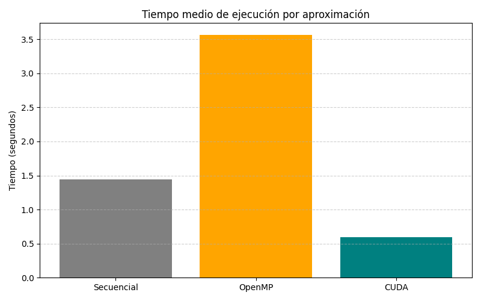

# Aceleración del Algoritmo Smith-Waterman (SW-Acceleration)


Este repositorio contiene tres implementaciones del algoritmo de **Smith-Waterman** para el alineamiento local de secuencias de ADN, diseñadas para evaluar y comparar el rendimiento en diferentes arquitecturas de hardware. El proyecto explora desde la ejecución secuencial clásica hasta la paralelización masiva en GPU.

## 🧬 Descripción del Proyecto

El alineamiento de secuencias es fundamental en bioinformática para identificar regiones de similitud que pueden indicar relaciones funcionales, estructurales o evolutivas. Dado que la complejidad del algoritmo original es $\theta(mn)$, su ejecución en grandes bases de datos genómicas es costosa.

Este proyecto implementa y compara tres aproximaciones:
1.  **Secuencial (CPU):** Implementación base en C.
2.  **Concurrente (CPU Multi-core):** Paralelización mediante **OpenMP** (estrategia *Wavefront*).
3.  **Paralela (GPU):** Aceleración masiva mediante **NVIDIA CUDA**.

## 🚀 Implementaciones

| Versión | Tecnología | Descripción Técnica |
| :--- | :--- | :--- |
| **Secuencial** | C | Cálculo iterativo de la matriz de puntuaciones y *traceback* estándar. |
| **OpenMP** | C + OpenMP | Procesamiento por diagonales (anti-diagonales) para resolver dependencias de datos en la matriz de programación dinámica. |
| **CUDA** | C + CUDA | Ejecución de *kernels* por diagonal, optimizando el uso de memoria compartida y accesos a memoria global. |

## 🛠️ Requisitos del Sistema

Para compilar y ejecutar este proyecto, necesitas:

* **Compilador C:** `gcc` (GNU Compiler Collection).
* **Toolkit CUDA:** `nvcc` (NVIDIA CUDA Compiler) para la versión GPU.
* **OpenMP:** Librería `libomp` (generalmente incluida con GCC).
* **Hardware:** * CPU Multi-núcleo.
    * GPU NVIDIA con soporte para CUDA (Arquitectura probada: RTX 3060).

## 💾 Compilación

Ejecutar `compile.sh` para compilar `src/Smith_Waterman.c`, `src/Smith_Waterman_OpenMP.c` y `src/Smith_Waterman_Cuda.cu` automáticamente.

## ▶️ Ejecución y Benchmarking

El proyecto incluye un script de automatización para realizar pruebas de rendimiento comparativas.

Uso del script de benchmarking:

```bash
chmod +x src/exec_times.sh
./src/exec_times.sh
```
Este script ejecutará 10 iteraciones de cada versión alineando los genomas mitocondriales de Homo sapiens y Pan troglodytes, generando un archivo times.txt con los resultados.

Ejecución manual (ejemplo CUDA):

```Bash
./Smith_Waterman_Cuda.exe resources/Homo_sapiens.fasta resources/Pan_troglodytes.fasta 128
```
El tercer argumento (128) especifica el tamaño del bloque de hilos en CUDA.

## 📊 Resultados

Los experimentos realizados (Ryzen 7 5800HS + RTX 3060) arrojaron las siguientes conclusiones:

- CUDA (GPU): Logró el mejor rendimiento, reduciendo drásticamente el tiempo de cómputo gracias a la paralelización masiva.

- OpenMP (CPU): Presentó una sobrecarga (overhead) de sincronización significativa debido a la naturaleza de las dependencias de datos (wavefront) en este algoritmo específico, rindiendo por debajo de la versión secuencial en ciertos escenarios.

<p align="center">
    
</p>

## 📂 Estructura del Repositorio

Plaintext

```
├── presentation/      # Diapositivas y recursos visuales
├── report/            # Memoria técnica en LaTeX
├── resources/         # Datasets (Archivos FASTA de ADN mitocondrial)
├── src/               # Código fuente (C, CUDA, Scripts)
└── README.md          # Documentación
└── compile.sh         # Script para compilar el proyecto
```

## ✒️ Autor

👤 Hugo Salas Calderón - 📧 Email: hugosalascalderon@gmail.com

## 📄 Licencia

Este proyecto está bajo la Licencia MIT- vea la [LICENCIA](LICENSE) para más detalles.
